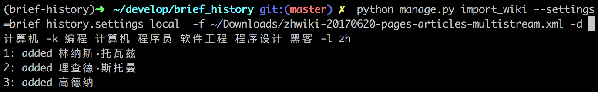
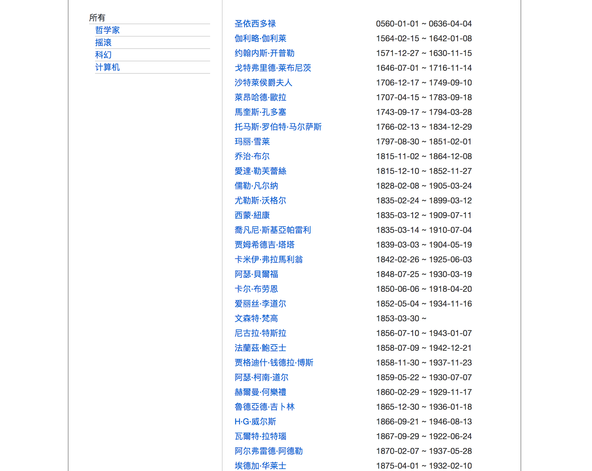

Brief History
=============

从 wikipedia 离线数据中提取出所有包含某些关键字的人物

Install
-------

* 安装依赖

		$ virtualenv venv
		$ source venv/bin/activate
		$ pip install -r requirements.txt
* 创建 `brief_history` 数据库
* 修改 `brief_history/settings.py` 中的 `DATABASES`
* 创建表

		$ python manage.py migrate

Usage
-----

使用的 wikipedia 数据来自: <https://dumps.wikimedia.org/zhwiki/20170620/>，可以自己任选其它版本。

**从 wikipedia 离线文件导入数据库：**

	# 比如提取计算机领域(-d 指定)，匹配关键字(-k 指定)
	# -l 表示使用的哪种语言的离线数据，保存 url 时需使用
	$ python manage.py import_wiki -f ~/Downloads/zhwiki-20170620-pages-articles-multistream.xml -d 计算机 -k 编程 计算机 程序员 软件工程 程序设计 黑客 -l zh

	# 摇滚
	$ python manage.py import_wiki -f ~/Downloads/zhwiki-20170620-pages-articles-multistream.xml -d 摇滚 -k 摇滚 -l zh

	# 哲学家
	$ python manage.py import_wiki -f ~/Downloads/zhwiki-20170620-pages-articles-multistream.xml -d 哲学家 -k 哲学家 -l zh

**从数据库删除某一领域的数据：**

	# 比如 "计算机"
	$ python manage.py delete_domain -n "计算机"

**运行网页端：**

	$ python manage.py runserver

References
----------

* [wikipedia离线数据下载](https://zh.wikipedia.org/wiki/Wikipedia:%E6%95%B0%E6%8D%AE%E5%BA%93%E4%B8%8B%E8%BD%BD)
* [zh:Template:Infobox_person](https://zh.wikipedia.org/wiki/Template:Infobox_person)
* [en:Template:Infobox_person](https://en.wikipedia.org/wiki/Template:Infobox_person)
* [Wikipedia:List_of_infoboxes](https://en.wikipedia.org/wiki/Wikipedia:List_of_infoboxes)
